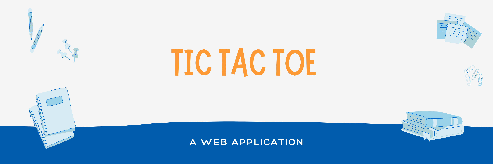

<h2> 🎰 TIC TAC TOE </h2>
Basically, The <a href="https://ajaiqmar.github.io/TIC_TAC_TOE/">Tic Tac Toe</a> 🎰 Application is a Two - player game application where in this case the User will be playing against a Non - Playable Character 🤖. The Non - Playable Character 🤖 makes its choice using a specific algorithm called the <a href="https://www.geeksforgeeks.org/minimax-algorithm-in-game-theory-set-1-introduction/">Minimax Algorithm</a>. The concept of Minimax Algorithm is basically to ensure that the Non - Playable Character 🤖 plays the best possible move during its turn. It uses a Recursion Tree and Backtracking to identify the best possible move. Try and win one game if possible!

<h2> 📝 PROBLEM DESCRIPTION </h2>
Here, The Main Focus  is to update the board each time the User or the Non - Playable Character 🤖 makes a move and to check whether the User has Won or the Non - Playable Character has Won or it is a Draw after every move. When it comes to checking the status of the game, The focus is to check if any three contigous cells in the table has the same symbol and the number of moves made is less than or equal to 9, If it contains such cells, then return the Winner of the Game, else if it doesn't contain such cells and the number of moves made is 9 then return that the game is Draw.

<h2> 📱TECHNOLOGY STACK </h2>

